# Pre-filter vs inline: per-test-case results

One section per test case. A test case is a single query varied against corpus size. Each has **separate** tables and graphs for the two dimensions:

1. **Latency** - single query, one connection, no concurrency. What the filtering decision does to an individual query.
2. **Throughput** - queries/sec under saturating load from multiple client processes. What it does to server capacity.

They are kept separate because they can disagree. The decision only changes work on the reader threads, so when the main thread is the ceiling the difference is hidden and throughput barely moves even where latency shows a large gap. The `bound` column in the throughput tables says which resource was saturated.

Common settings: dim 768, k 10, corpus clustered, `ef_runtime` at the server default (10), L2 distance, HASH keys. Selectivity is exact: doc `i` carries the marker for every level `L` where `i < L*N`, and is verified per point with a filter-only `FT.SEARCH ... LIMIT 0 0` count.

Throughput load: 8 processes x 4 connections, 4 reader threads, 2.0s per point.

---

## Test case: numeric

Query template:

```
(@num:[0 {S}])=>[KNN k @vec $v AS score]
```

Concrete example at N=20,000 and 1% selectivity (200 matching rows):

```
FT.SEARCH idx "(@num:[0 199])=>[KNN 10 @vec $v AS score]" PARAMS 2 v <vector> LIMIT 0 10 DIALECT 2 NOCONTENT
```

### Dimension 1: latency

| selectivity | N=5,000 | N=20,000 | N=80,000 | N=320,000 | N=1,280,000 |
|---|---|---|---|---|---|
| 0.100% | **27.61x** (2.10 / 0.08) | **71.27x** (6.09 / 0.09) | **76.35x** (8.68 / 0.11) | **73.03x** (11.13 / 0.15) | **25.81x** (15.60 / 0.60) |
| 0.200% | **24.28x** (1.94 / 0.08) | **39.65x** (3.41 / 0.09) | **42.80x** (4.65 / 0.11) | **19.61x** (6.25 / 0.32) | **6.07x** (7.27 / 1.20) |
| 0.400% | **15.46x** (1.31 / 0.08) | **21.42x** (2.00 / 0.09) | **16.58x** (2.48 / 0.15) | **6.13x** (3.49 / 0.57) | **2.54x** (5.42 / 2.13) |
| 0.700% | **12.01x** (0.99 / 0.08) | **11.29x** (1.20 / 0.11) | **7.43x** (1.80 / 0.24) | **2.02x** (1.90 / 0.94) | **1.00x** (4.59 / 4.58) |
| 1.000% | **7.90x** (0.68 / 0.09) | **7.87x** (0.92 / 0.12) | **3.58x** (1.27 / 0.35) | **1.18x** (1.51 / 1.28) | **0.60x** (3.71 / 6.15) |
| 2.000% | **3.57x** (0.36 / 0.10) | **3.06x** (0.53 / 0.17) | **1.19x** (0.76 / 0.64) | **0.46x** (1.12 / 2.45) | **0.15x** (2.66 / 17.55) |
| 3.500% | **2.99x** (0.34 / 0.11) | **1.77x** (0.55 / 0.31) | **0.46x** (0.47 / 1.03) | **0.22x** (0.99 / 4.58) | **0.06x** (2.13 / 34.93) |
| 5.000% | **1.57x** (0.20 / 0.13) | **0.84x** (0.35 / 0.41) | **0.26x** (0.38 / 1.44) | **0.13x** (0.89 / 6.89) | **0.03x** (1.63 / 54.01) |
| 7.000% | **1.28x** (0.19 / 0.14) | **0.51x** (0.27 / 0.53) | **0.17x** (0.34 / 2.00) | **0.06x** (0.77 / 12.24) | **0.02x** (1.37 / 76.54) |
| 10.000% | **0.76x** (0.15 / 0.20) | **0.29x** (0.21 / 0.72) | **0.11x** (0.31 / 2.80) | **0.03x** (0.67 / 20.28) | **0.01x** (0.99 / 110.18) |

Cells are **gain** (inline ms / pre-filter ms for latency, pre-filter qps / inline qps for throughput) with (inline / pre-filter) raw ms in brackets. Gain > 1 means pre-filtering is faster per query.

Crossover (where pre-filtering stops winning): N=5,000 → 8.27%, N=20,000 → 4.61%, N=80,000 → 2.22%, N=320,000 → 1.13%, N=1,280,000 → 0.70%

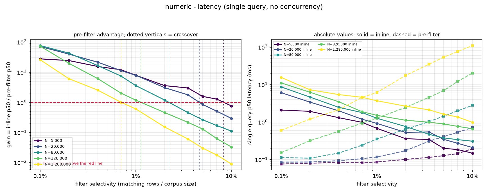

### Dimension 2: throughput under saturating load

| selectivity | N=5,000 | N=20,000 | N=80,000 | N=320,000 | N=1,280,000 |
|---|---|---|---|---|---|
| 0.100% | **6.78x** (1958 / 13271) | **17.38x** (725 / 12611) | **26.55x** (476 / 12646) | **31.60x** (389 / 12289) | **32.35x** (259 / 8375) |
| 0.200% | **6.22x** (2063 / 12826) | **10.67x** (1181 / 12600) | **12.80x** (976 / 12491) | **17.64x** (694 / 12242) | **7.29x** (574 / 4180) |
| 0.400% | **3.91x** (3269 / 12774) | **6.18x** (2052 / 12680) | **6.36x** (1934 / 12303) | **6.49x** (1319 / 8561) | **2.67x** (798 / 2127) |
| 0.700% | **2.67x** (4768 / 12748) | **3.18x** (3958 / 12582) | **3.96x** (3095 / 12246) | **1.95x** (2591 / 5058) | **1.23x** (994 / 1228) |
| 1.000% | **1.95x** (6528 / 12751) | **2.48x** (5020 / 12428) | **2.80x** (4427 / 12382) | **1.07x** (3363 / 3582) | **0.73x** (1163 / 845) |
| 2.000% | **1.05x** (12043 / 12665) | **1.27x** (9656 / 12287) | **0.81x** (9495 / 7703) | **0.38x** (4778 / 1817) | **0.14x** (1612 / 226) |
| 3.500% | **1.03x** (12099 / 12493) | **1.01x** (12036 / 12186) | **0.37x** (12100 / 4469) | **0.17x** (6073 / 1062) | **0.05x** (2177 / 105) |
| 5.000% | **1.04x** (11871 / 12378) | **1.02x** (11827 / 12112) | **0.26x** (12107 / 3099) | **0.08x** (8042 / 663) | **0.03x** (2701 / 74) |
| 7.000% | **1.01x** (11990 / 12112) | **0.79x** (11844 / 9397) | **0.18x** (12141 / 2233) | **0.04x** (9403 / 330) | **0.01x** (3602 / 53) |
| 10.000% | **1.02x** (11959 / 12250) | **0.56x** (12026 / 6717) | **0.13x** (11932 / 1604) | **0.02x** (11295 / 182) | **0.01x** (5122 / 37) |

Cells are **gain** (inline qps / pre-filter qps for latency, pre-filter qps / inline qps for throughput) with (inline / pre-filter) raw qps in brackets. Gain > 1 means pre-filtering is higher throughput.

Crossover (where pre-filtering stops winning): N=5,000 → n/a, N=20,000 → 5.13%, N=80,000 → 1.78%, N=320,000 → 1.04%, N=1,280,000 → 0.81%

Saturation, per corpus size (inline path):

| N | selectivity | main thread CPU | reader pool CPU | bound |
|---|---|---|---|---|
| 5,000 | 0.100% | 7% | 400% (cap 400%) | reader-bound/client-bound |
| 5,000 | 0.700% | 15% | 400% (cap 400%) | reader-bound/client-bound |
| 5,000 | 3.500% | 38% | 262% (cap 400%) | client-bound |
| 5,000 | 10.000% | 37% | 104% (cap 400%) | client-bound |
| 20,000 | 0.100% | 4% | 399% (cap 400%) | reader-bound/client-bound |
| 20,000 | 0.700% | 13% | 398% (cap 400%) | reader-bound/client-bound |
| 20,000 | 3.500% | 40% | 346% (cap 400%) | client-bound |
| 20,000 | 10.000% | 39% | 144% (cap 400%) | client-bound/reader-bound |
| 80,000 | 0.100% | 3% | 398% (cap 400%) | reader-bound/client-bound |
| 80,000 | 0.700% | 12% | 399% (cap 400%) | reader-bound/client-bound |
| 80,000 | 3.500% | 40% | 339% (cap 400%) | client-bound/reader-bound |
| 80,000 | 10.000% | 40% | 219% (cap 400%) | client-bound/reader-bound |
| 320,000 | 0.100% | 2% | 399% (cap 400%) | reader-bound/client-bound |
| 320,000 | 0.700% | 9% | 399% (cap 400%) | reader-bound |
| 320,000 | 3.500% | 20% | 399% (cap 400%) | reader-bound |
| 320,000 | 10.000% | 37% | 397% (cap 400%) | reader-bound |
| 1,280,000 | 0.100% | 2% | 398% (cap 400%) | reader-bound |
| 1,280,000 | 0.700% | 4% | 400% (cap 400%) | reader-bound |
| 1,280,000 | 3.500% | 9% | 397% (cap 400%) | reader-bound |
| 1,280,000 | 10.000% | 16% | 397% (cap 400%) | reader-bound |

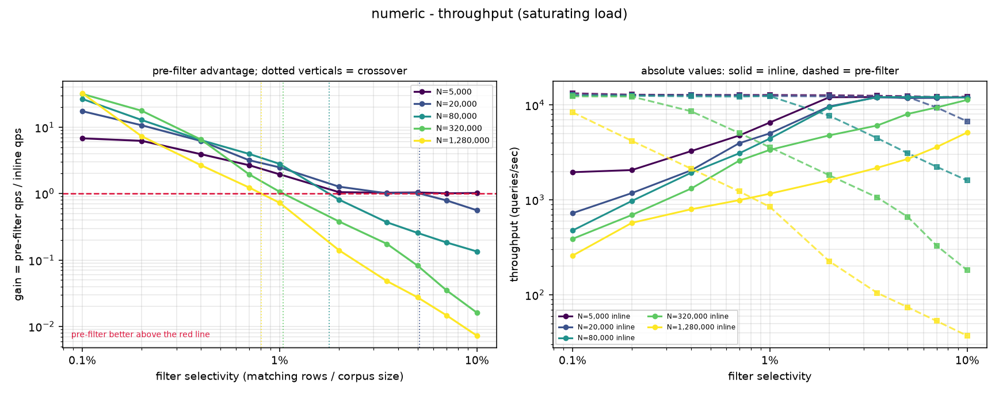

---

## Test case: tag

Query template:

```
(@tg:{{{L}}})=>[KNN k @vec $v AS score]
```

Concrete example at N=20,000 and 1% selectivity (200 matching rows):

```
FT.SEARCH idx "(@tg:{s100})=>[KNN 10 @vec $v AS score]" PARAMS 2 v <vector> LIMIT 0 10 DIALECT 2 NOCONTENT
```

### Dimension 1: latency

| selectivity | N=5,000 | N=20,000 | N=80,000 | N=320,000 | N=1,280,000 |
|---|---|---|---|---|---|
| 0.100% | **31.33x** (2.51 / 0.08) | **83.24x** (8.06 / 0.10) | **67.69x** (10.06 / 0.15) | **34.10x** (12.49 / 0.37) | **11.20x** (17.45 / 1.56) |
| 0.200% | **27.40x** (2.34 / 0.09) | **35.45x** (4.03 / 0.11) | **22.70x** (4.79 / 0.21) | **9.40x** (6.73 / 0.72) | **2.71x** (8.09 / 2.99) |
| 0.400% | **15.67x** (1.49 / 0.10) | **15.38x** (2.23 / 0.14) | **8.72x** (2.94 / 0.34) | **2.69x** (3.79 / 1.41) | **1.06x** (6.14 / 5.79) |
| 0.700% | **10.15x** (1.06 / 0.10) | **8.37x** (1.46 / 0.17) | **3.56x** (2.00 / 0.56) | **0.86x** (1.99 / 2.31) | **0.49x** (4.88 / 9.87) |
| 1.000% | **6.80x** (0.76 / 0.11) | **4.64x** (0.96 / 0.21) | **1.61x** (1.25 / 0.77) | **0.52x** (1.67 / 3.19) | **0.29x** (4.21 / 14.37) |
| 2.000% | **2.80x** (0.38 / 0.14) | **1.85x** (0.59 / 0.32) | **0.55x** (0.78 / 1.42) | **0.22x** (1.31 / 5.89) | **0.08x** (2.90 / 37.73) |
| 3.500% | **2.05x** (0.34 / 0.17) | **0.98x** (0.57 / 0.58) | **0.23x** (0.54 / 2.31) | **0.09x** (1.08 / 11.47) | **0.03x** (2.24 / 71.03) |
| 5.000% | **1.11x** (0.22 / 0.20) | **0.51x** (0.38 / 0.76) | **0.14x** (0.42 / 3.08) | **0.06x** (0.94 / 14.90) | **0.02x** (1.73 / 104.21) |
| 7.000% | **0.83x** (0.20 / 0.23) | **0.29x** (0.29 / 1.02) | **0.10x** (0.41 / 4.10) | **0.04x** (0.85 / 23.04) | **0.01x** (1.51 / 142.24) |
| 10.000% | **0.51x** (0.15 / 0.30) | **0.17x** (0.23 / 1.32) | **0.07x** (0.37 / 5.39) | **0.02x** (0.71 / 37.63) | **0.01x** (1.10 / 200.47) |

Cells are **gain** (inline ms / pre-filter ms for latency, pre-filter qps / inline qps for throughput) with (inline / pre-filter) raw ms in brackets. Gain > 1 means pre-filtering is faster per query.

Crossover (where pre-filtering stops winning): N=5,000 → 5.64%, N=20,000 → 3.45%, N=80,000 → 1.36%, N=320,000 → 0.65%, N=1,280,000 → 0.42%

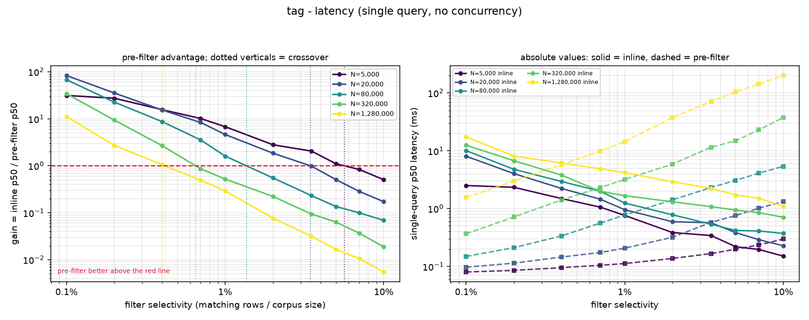

### Dimension 2: throughput under saturating load

| selectivity | N=5,000 | N=20,000 | N=80,000 | N=320,000 | N=1,280,000 |
|---|---|---|---|---|---|
| 0.100% | **8.07x** (1653 / 13346) | **20.57x** (611 / 12568) | **31.09x** (411 / 12775) | **33.17x** (346 / 11489) | **11.10x** (238 / 2638) |
| 0.200% | **7.15x** (1773 / 12672) | **12.56x** (1002 / 12590) | **14.66x** (848 / 12438) | **8.63x** (627 / 5411) | **2.50x** (520 / 1299) |
| 0.400% | **4.56x** (2791 / 12728) | **6.90x** (1813 / 12503) | **7.08x** (1695 / 12005) | **2.24x** (1208 / 2707) | **0.91x** (723 / 658) |
| 0.700% | **3.03x** (4136 / 12525) | **3.52x** (3517 / 12386) | **2.67x** (2712 / 7247) | **0.70x** (2326 / 1636) | **0.45x** (903 / 402) |
| 1.000% | **2.25x** (5619 / 12646) | **2.79x** (4388 / 12262) | **1.29x** (3969 / 5100) | **0.39x** (3045 / 1175) | **0.26x** (1064 / 276) |
| 2.000% | **1.12x** (11300 / 12636) | **1.42x** (8558 / 12158) | **0.31x** (8416 / 2648) | **0.14x** (4406 / 627) | **0.06x** (1525 / 97) |
| 3.500% | **1.02x** (12097 / 12369) | **0.67x** (11915 / 7976) | **0.13x** (11860 / 1589) | **0.06x** (5714 / 364) | **0.02x** (2047 / 51) |
| 5.000% | **1.03x** (12018 / 12366) | **0.48x** (12066 / 5757) | **0.10x** (11977 / 1186) | **0.04x** (6829 / 249) | **0.01x** (2639 / 36) |
| 7.000% | **1.01x** (11896 / 12055) | **0.36x** (11829 / 4241) | **0.07x** (11978 / 884) | **0.02x** (8850 / 140) | **0.01x** (3473 / 26) |
| 10.000% | **1.03x** (11744 / 12116) | **0.28x** (11882 / 3299) | **0.06x** (12073 / 710) | **0.01x** (11054 / 92) | **0.00x** (5061 / 19) |

Cells are **gain** (inline qps / pre-filter qps for latency, pre-filter qps / inline qps for throughput) with (inline / pre-filter) raw qps in brackets. Gain > 1 means pre-filtering is higher throughput.

Crossover (where pre-filtering stops winning): N=5,000 → n/a, N=20,000 → 2.60%, N=80,000 → 1.13%, N=320,000 → 0.59%, N=1,280,000 → 0.37%

Saturation, per corpus size (inline path):

| N | selectivity | main thread CPU | reader pool CPU | bound |
|---|---|---|---|---|
| 5,000 | 0.100% | 8% | 399% (cap 400%) | reader-bound/client-bound |
| 5,000 | 0.700% | 13% | 399% (cap 400%) | reader-bound/client-bound |
| 5,000 | 3.500% | 40% | 289% (cap 400%) | client-bound |
| 5,000 | 10.000% | 37% | 117% (cap 400%) | client-bound |
| 20,000 | 0.100% | 3% | 398% (cap 400%) | reader-bound/client-bound |
| 20,000 | 0.700% | 12% | 399% (cap 400%) | reader-bound/client-bound |
| 20,000 | 3.500% | 38% | 377% (cap 400%) | reader-bound |
| 20,000 | 10.000% | 37% | 156% (cap 400%) | client-bound/reader-bound |
| 80,000 | 0.100% | 2% | 399% (cap 400%) | reader-bound/client-bound |
| 80,000 | 0.700% | 11% | 399% (cap 400%) | reader-bound |
| 80,000 | 3.500% | 37% | 367% (cap 400%) | reader-bound |
| 80,000 | 10.000% | 39% | 242% (cap 400%) | client-bound/reader-bound |
| 320,000 | 0.100% | 2% | 399% (cap 400%) | reader-bound |
| 320,000 | 0.700% | 9% | 399% (cap 400%) | reader-bound |
| 320,000 | 3.500% | 19% | 399% (cap 400%) | reader-bound |
| 320,000 | 10.000% | 36% | 398% (cap 400%) | reader-bound |
| 1,280,000 | 0.100% | 1% | 398% (cap 400%) | reader-bound |
| 1,280,000 | 0.700% | 4% | 399% (cap 400%) | reader-bound |
| 1,280,000 | 3.500% | 9% | 400% (cap 400%) | reader-bound |
| 1,280,000 | 10.000% | 17% | 398% (cap 400%) | reader-bound |

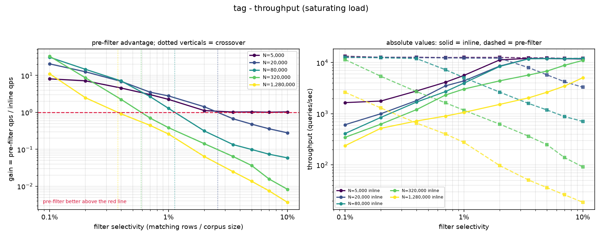

---

## Test case: text

Query template:

```
(@txt:{L})=>[KNN k @vec $v AS score]
```

Concrete example at N=20,000 and 1% selectivity (200 matching rows):

```
FT.SEARCH idx "(@txt:s100)=>[KNN 10 @vec $v AS score]" PARAMS 2 v <vector> LIMIT 0 10 DIALECT 2 NOCONTENT
```

### Dimension 1: latency

| selectivity | N=5,000 | N=20,000 | N=80,000 | N=320,000 | N=1,280,000 |
|---|---|---|---|---|---|
| 0.100% | **43.91x** (3.47 / 0.08) | **96.23x** (9.20 / 0.10) | **120.52x** (13.85 / 0.11) | **71.30x** (16.40 / 0.23) | **18.67x** (21.33 / 1.14) |
| 0.200% | **36.79x** (3.11 / 0.08) | **56.58x** (5.61 / 0.10) | **42.04x** (5.88 / 0.14) | **16.87x** (8.58 / 0.51) | **4.88x** (10.29 / 2.11) |
| 0.400% | **21.49x** (1.91 / 0.09) | **25.49x** (2.81 / 0.11) | **18.38x** (3.85 / 0.21) | **5.00x** (4.85 / 0.97) | **1.84x** (7.62 / 4.14) |
| 0.700% | **14.61x** (1.35 / 0.09) | **13.37x** (1.76 / 0.13) | **6.21x** (2.43 / 0.39) | **1.50x** (2.51 / 1.67) | **0.67x** (6.05 / 8.98) |
| 1.000% | **9.84x** (0.99 / 0.10) | **7.80x** (1.23 / 0.16) | **2.72x** (1.67 / 0.61) | **0.86x** (2.04 / 2.38) | **0.34x** (4.86 / 14.33) |
| 2.000% | **4.09x** (0.48 / 0.12) | **2.82x** (0.73 / 0.26) | **0.88x** (0.93 / 1.06) | **0.36x** (1.60 / 4.40) | **0.09x** (3.34 / 35.41) |
| 3.500% | **3.13x** (0.44 / 0.14) | **1.41x** (0.67 / 0.47) | **0.35x** (0.63 / 1.77) | **0.14x** (1.25 / 8.65) | **0.04x** (2.55 / 68.75) |
| 5.000% | **1.58x** (0.25 / 0.16) | **0.74x** (0.44 / 0.59) | **0.21x** (0.54 / 2.51) | **0.08x** (1.10 / 13.68) | **0.02x** (2.02 / 101.22) |
| 7.000% | **1.14x** (0.23 / 0.21) | **0.40x** (0.32 / 0.81) | **0.15x** (0.52 / 3.39) | **0.04x** (0.93 / 21.57) | **0.01x** (1.68 / 147.64) |
| 10.000% | **0.62x** (0.17 / 0.28) | **0.21x** (0.23 / 1.10) | **0.08x** (0.39 / 4.87) | **0.02x** (0.81 / 35.07) | **0.01x** (1.30 / 201.71) |

Cells are **gain** (inline ms / pre-filter ms for latency, pre-filter qps / inline qps for throughput) with (inline / pre-filter) raw ms in brackets. Gain > 1 means pre-filtering is faster per query.

Crossover (where pre-filtering stops winning): N=5,000 → 7.57%, N=20,000 → 4.23%, N=80,000 → 1.85%, N=320,000 → 0.91%, N=1,280,000 → 0.56%

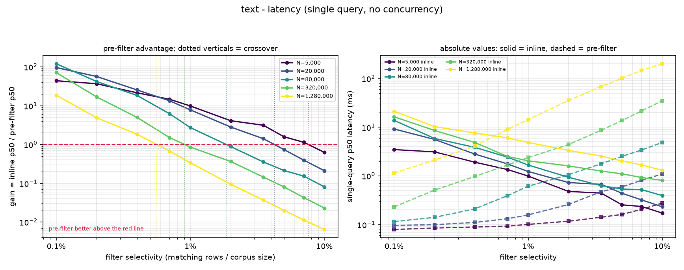

### Dimension 2: throughput under saturating load

| selectivity | N=5,000 | N=20,000 | N=80,000 | N=320,000 | N=1,280,000 |
|---|---|---|---|---|---|
| 0.100% | **12.74x** (1055 / 13446) | **31.30x** (404 / 12652) | **43.58x** (291 / 12691) | **48.31x** (254 / 12262) | **16.92x** (182 / 3076) |
| 0.200% | **10.86x** (1177 / 12784) | **18.59x** (675 / 12547) | **21.13x** (599 / 12650) | **14.78x** (467 / 6902) | **3.81x** (396 / 1510) |
| 0.400% | **6.61x** (1902 / 12580) | **9.71x** (1289 / 12513) | **9.59x** (1282 / 12290) | **3.84x** (877 / 3365) | **1.33x** (555 / 740) |
| 0.700% | **4.44x** (2837 / 12601) | **4.90x** (2533 / 12404) | **4.84x** (1958 / 9472) | **1.14x** (1639 / 1860) | **0.59x** (704 / 416) |
| 1.000% | **3.12x** (4006 / 12504) | **3.76x** (3312 / 12457) | **2.11x** (2747 / 5801) | **0.60x** (2127 / 1273) | **0.30x** (845 / 253) |
| 2.000% | **1.47x** (8522 / 12521) | **1.86x** (6539 / 12150) | **0.46x** (6001 / 2735) | **0.21x** (3067 / 638) | **0.06x** (1253 / 74) |
| 3.500% | **1.03x** (12067 / 12446) | **0.75x** (9911 / 7469) | **0.15x** (10360 / 1537) | **0.08x** (4220 / 354) | **0.02x** (1716 / 39) |
| 5.000% | **1.03x** (11945 / 12306) | **0.42x** (11917 / 4953) | **0.10x** (11824 / 1132) | **0.04x** (5316 / 200) | **0.01x** (2105 / 27) |
| 7.000% | **1.02x** (11896 / 12112) | **0.30x** (11679 / 3462) | **0.06x** (12210 / 769) | **0.02x** (6885 / 104) | **0.01x** (2876 / 19) |
| 10.000% | **1.01x** (11909 / 12052) | **0.20x** (11811 / 2367) | **0.04x** (11999 / 538) | **0.01x** (8720 / 62) | **0.00x** (4108 / 13) |

Cells are **gain** (inline qps / pre-filter qps for latency, pre-filter qps / inline qps for throughput) with (inline / pre-filter) raw qps in brackets. Gain > 1 means pre-filtering is higher throughput.

Crossover (where pre-filtering stops winning): N=5,000 → n/a, N=20,000 → 2.93%, N=80,000 → 1.40%, N=320,000 → 0.75%, N=1,280,000 → 0.49%

Saturation, per corpus size (inline path):

| N | selectivity | main thread CPU | reader pool CPU | bound |
|---|---|---|---|---|
| 5,000 | 0.100% | 4% | 398% (cap 400%) | reader-bound/client-bound |
| 5,000 | 0.700% | 10% | 398% (cap 400%) | reader-bound/client-bound |
| 5,000 | 3.500% | 39% | 373% (cap 400%) | reader-bound/client-bound |
| 5,000 | 10.000% | 39% | 145% (cap 400%) | client-bound/reader-bound |
| 20,000 | 0.100% | 2% | 398% (cap 400%) | reader-bound/client-bound |
| 20,000 | 0.700% | 9% | 399% (cap 400%) | reader-bound/client-bound |
| 20,000 | 3.500% | 31% | 398% (cap 400%) | reader-bound |
| 20,000 | 10.000% | 39% | 196% (cap 400%) | client-bound/reader-bound |
| 80,000 | 0.100% | 2% | 399% (cap 400%) | reader-bound/client-bound |
| 80,000 | 0.700% | 8% | 398% (cap 400%) | reader-bound |
| 80,000 | 3.500% | 34% | 398% (cap 400%) | reader-bound |
| 80,000 | 10.000% | 39% | 307% (cap 400%) | client-bound/reader-bound |
| 320,000 | 0.100% | 1% | 397% (cap 400%) | reader-bound/client-bound |
| 320,000 | 0.700% | 7% | 400% (cap 400%) | reader-bound |
| 320,000 | 3.500% | 14% | 399% (cap 400%) | reader-bound |
| 320,000 | 10.000% | 31% | 398% (cap 400%) | reader-bound |
| 1,280,000 | 0.100% | 1% | 396% (cap 400%) | reader-bound |
| 1,280,000 | 0.700% | 3% | 399% (cap 400%) | reader-bound |
| 1,280,000 | 3.500% | 7% | 399% (cap 400%) | reader-bound |
| 1,280,000 | 10.000% | 14% | 399% (cap 400%) | reader-bound |

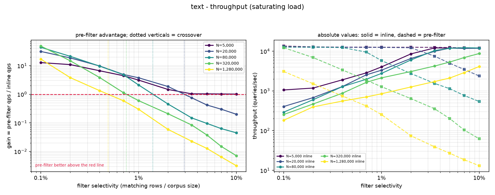

---

## Test case: text OR text

Query template:

```
(@txt:{L} | @txt:s5)=>[KNN k @vec $v AS score]
```

Concrete example at N=20,000 and 1% selectivity (200 matching rows):

```
FT.SEARCH idx "(@txt:s100 | @txt:s5)=>[KNN 10 @vec $v AS score]" PARAMS 2 v <vector> LIMIT 0 10 DIALECT 2 NOCONTENT
```

### Dimension 1: latency

| selectivity | N=5,000 | N=20,000 | N=80,000 | N=320,000 | N=1,280,000 |
|---|---|---|---|---|---|
| 0.100% | **49.66x** (4.08 / 0.08) | **113.31x** (10.87 / 0.10) | **121.31x** (15.29 / 0.13) | **62.60x** (17.93 / 0.29) | **14.02x** (23.00 / 1.64) |
| 0.200% | **42.44x** (3.75 / 0.09) | **56.10x** (6.20 / 0.11) | **43.55x** (6.56 / 0.15) | **16.91x** (9.91 / 0.59) | **4.24x** (11.30 / 2.66) |
| 0.400% | **24.48x** (2.27 / 0.09) | **29.41x** (3.38 / 0.11) | **18.21x** (4.49 / 0.25) | **4.95x** (5.58 / 1.13) | **1.80x** (8.27 / 4.60) |
| 0.700% | **16.22x** (1.57 / 0.10) | **13.37x** (1.99 / 0.15) | **6.47x** (2.75 / 0.42) | **1.53x** (2.71 / 1.77) | **0.71x** (6.78 / 9.57) |
| 1.000% | **11.27x** (1.14 / 0.10) | **8.00x** (1.35 / 0.17) | **2.94x** (1.79 / 0.61) | **0.95x** (2.30 / 2.43) | **0.37x** (5.39 / 14.56) |
| 2.000% | **4.60x** (0.55 / 0.12) | **2.93x** (0.78 / 0.27) | **0.88x** (0.98 / 1.12) | **0.37x** (1.66 / 4.54) | **0.09x** (3.54 / 37.47) |
| 3.500% | **3.54x** (0.51 / 0.14) | **1.58x** (0.72 / 0.46) | **0.36x** (0.65 / 1.83) | **0.15x** (1.42 / 9.32) | **0.04x** (2.59 / 73.68) |
| 5.000% | **1.68x** (0.29 / 0.17) | **0.74x** (0.45 / 0.61) | **0.23x** (0.59 / 2.57) | **0.08x** (1.16 / 14.20) | **0.02x** (2.11 / 108.89) |
| 7.000% | **1.22x** (0.26 / 0.21) | **0.42x** (0.34 / 0.83) | **0.14x** (0.50 / 3.49) | **0.04x** (0.97 / 23.51) | **0.01x** (1.74 / 154.58) |
| 10.000% | **0.64x** (0.20 / 0.31) | **0.23x** (0.26 / 1.15) | **0.09x** (0.43 / 4.99) | **0.02x** (0.85 / 35.42) | **0.01x** (1.29 / 217.01) |

Cells are **gain** (inline ms / pre-filter ms for latency, pre-filter qps / inline qps for throughput) with (inline / pre-filter) raw ms in brackets. Gain > 1 means pre-filtering is faster per query.

Crossover (where pre-filtering stops winning): N=5,000 → 7.81%, N=20,000 → 4.33%, N=80,000 → 1.86%, N=320,000 → 0.96%, N=1,280,000 → 0.57%

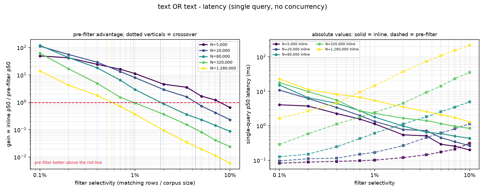

### Dimension 2: throughput under saturating load

| selectivity | N=5,000 | N=20,000 | N=80,000 | N=320,000 | N=1,280,000 |
|---|---|---|---|---|---|
| 0.100% | **17.30x** (770 / 13319) | **40.21x** (312 / 12530) | **52.50x** (242 / 12686) | **55.70x** (221 / 12325) | **12.28x** (165 / 2020) |
| 0.200% | **14.93x** (849 / 12673) | **24.04x** (524 / 12591) | **25.50x** (490 / 12495) | **14.62x** (411 / 6008) | **3.32x** (354 / 1178) |
| 0.400% | **8.86x** (1420 / 12587) | **12.03x** (1042 / 12529) | **11.75x** (1049 / 12328) | **3.88x** (751 / 2910) | **1.29x** (499 / 644) |
| 0.700% | **5.81x** (2175 / 12627) | **5.97x** (2089 / 12477) | **5.30x** (1710 / 9058) | **1.20x** (1435 / 1725) | **0.59x** (644 / 381) |
| 1.000% | **4.04x** (3113 / 12573) | **4.54x** (2712 / 12317) | **2.41x** (2371 / 5706) | **0.66x** (1805 / 1198) | **0.29x** (771 / 227) |
| 2.000% | **1.85x** (6689 / 12356) | **2.27x** (5370 / 12196) | **0.53x** (4886 / 2611) | **0.24x** (2626 / 620) | **0.06x** (1163 / 72) |
| 3.500% | **1.15x** (10728 / 12388) | **0.90x** (7898 / 7105) | **0.18x** (8337 / 1466) | **0.09x** (3688 / 338) | **0.02x** (1601 / 38) |
| 5.000% | **1.01x** (12073 / 12216) | **0.43x** (10997 / 4767) | **0.10x** (10585 / 1102) | **0.04x** (4638 / 189) | **0.01x** (2000 / 27) |
| 7.000% | **1.02x** (12012 / 12193) | **0.29x** (11961 / 3453) | **0.06x** (11897 / 754) | **0.02x** (5998 / 101) | **0.01x** (2759 / 18) |
| 10.000% | **1.00x** (12181 / 12163) | **0.19x** (11911 / 2276) | **0.04x** (12099 / 529) | **0.01x** (7426 / 62) | **0.00x** (3750 / 13) |

Cells are **gain** (inline qps / pre-filter qps for latency, pre-filter qps / inline qps for throughput) with (inline / pre-filter) raw qps in brackets. Gain > 1 means pre-filtering is higher throughput.

Crossover (where pre-filtering stops winning): N=5,000 → 10.00%, N=20,000 → 3.28%, N=80,000 → 1.50%, N=320,000 → 0.78%, N=1,280,000 → 0.48%

Saturation, per corpus size (inline path):

| N | selectivity | main thread CPU | reader pool CPU | bound |
|---|---|---|---|---|
| 5,000 | 0.100% | 4% | 399% (cap 400%) | reader-bound/client-bound |
| 5,000 | 0.700% | 9% | 399% (cap 400%) | reader-bound/client-bound |
| 5,000 | 3.500% | 35% | 398% (cap 400%) | reader-bound/client-bound |
| 5,000 | 10.000% | 41% | 178% (cap 400%) | client-bound/reader-bound |
| 20,000 | 0.100% | 3% | 399% (cap 400%) | reader-bound/client-bound |
| 20,000 | 0.700% | 9% | 399% (cap 400%) | reader-bound/client-bound |
| 20,000 | 3.500% | 27% | 398% (cap 400%) | reader-bound |
| 20,000 | 10.000% | 41% | 225% (cap 400%) | client-bound/reader-bound |
| 80,000 | 0.100% | 2% | 396% (cap 400%) | reader-bound/client-bound |
| 80,000 | 0.700% | 7% | 399% (cap 400%) | reader-bound |
| 80,000 | 3.500% | 28% | 399% (cap 400%) | reader-bound |
| 80,000 | 10.000% | 41% | 345% (cap 400%) | client-bound/reader-bound |
| 320,000 | 0.100% | 2% | 398% (cap 400%) | reader-bound/client-bound |
| 320,000 | 0.700% | 6% | 399% (cap 400%) | reader-bound |
| 320,000 | 3.500% | 14% | 398% (cap 400%) | reader-bound |
| 320,000 | 10.000% | 27% | 397% (cap 400%) | reader-bound |
| 1,280,000 | 0.100% | 3% | 396% (cap 400%) | reader-bound |
| 1,280,000 | 0.700% | 3% | 399% (cap 400%) | reader-bound |
| 1,280,000 | 3.500% | 6% | 399% (cap 400%) | reader-bound |
| 1,280,000 | 10.000% | 19% | 398% (cap 400%) | reader-bound |

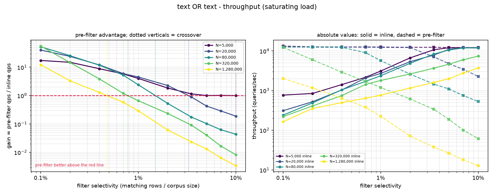

---

## Test case: text AND text

Query template:

```
(@txt:{L} @txt:all)=>[KNN k @vec $v AS score]
```

Concrete example at N=20,000 and 1% selectivity (200 matching rows):

```
FT.SEARCH idx "(@txt:s100 @txt:all)=>[KNN 10 @vec $v AS score]" PARAMS 2 v <vector> LIMIT 0 10 DIALECT 2 NOCONTENT
```

> **This test case is invalid for the inline path.** Inline filtering drops text predicates under a composed AND, so it returns documents that do not match the filter and does almost no filtering work. Its numbers below measure a broken execution and must not drive a threshold decision. Kept because it documents the bug (Issue 1).

### Dimension 1: latency

| selectivity | N=5,000 | N=20,000 | N=80,000 | N=320,000 | N=1,280,000 |
|---|---|---|---|---|---|
| 0.100% | **1.71x** (0.13 / 0.08) | **1.70x** (0.15 / 0.09) | **1.81x** (0.19 / 0.11) | **1.48x** (0.26 / 0.18) | **0.48x** (0.35 / 0.72) |
| 0.200% | **1.37x** (0.12 / 0.09) | **1.50x** (0.14 / 0.09) | **1.29x** (0.17 / 0.13) | **0.66x** (0.23 / 0.35) | **0.23x** (0.31 / 1.33) |
| 0.400% | **1.37x** (0.12 / 0.09) | **1.34x** (0.14 / 0.10) | **0.92x** (0.16 / 0.17) | **0.35x** (0.23 / 0.66) | **0.12x** (0.31 / 2.55) |
| 0.700% | **1.51x** (0.14 / 0.09) | **1.28x** (0.16 / 0.12) | **0.65x** (0.20 / 0.31) | **0.25x** (0.27 / 1.08) | **0.07x** (0.33 / 4.50) |
| 1.000% | **1.23x** (0.12 / 0.10) | **1.03x** (0.15 / 0.15) | **0.46x** (0.20 / 0.44) | **0.17x** (0.25 / 1.50) | **0.05x** (0.32 / 6.73) |
| 2.000% | **1.07x** (0.11 / 0.11) | **0.70x** (0.14 / 0.20) | **0.24x** (0.18 / 0.74) | **0.09x** (0.25 / 2.89) | **0.02x** (0.33 / 18.28) |
| 3.500% | **1.06x** (0.14 / 0.13) | **0.50x** (0.17 / 0.34) | **0.16x** (0.20 / 1.25) | **0.05x** (0.27 / 5.28) | **0.01x** (0.33 / 40.66) |
| 5.000% | **0.83x** (0.13 / 0.16) | **0.31x** (0.15 / 0.47) | **0.11x** (0.20 / 1.71) | **0.03x** (0.29 / 8.81) | **0.01x** (0.33 / 56.08) |
| 7.000% | **0.73x** (0.13 / 0.18) | **0.22x** (0.14 / 0.61) | **0.08x** (0.19 / 2.36) | **0.02x** (0.27 / 14.00) | **0.00x** (0.34 / 82.74) |
| 10.000% | **0.54x** (0.13 / 0.23) | **0.17x** (0.14 / 0.84) | **0.06x** (0.20 / 3.29) | **0.01x** (0.27 / 21.93) | **0.00x** (0.34 / 119.36) |

Cells are **gain** (inline ms / pre-filter ms for latency, pre-filter qps / inline qps for throughput) with (inline / pre-filter) raw ms in brackets. Gain > 1 means pre-filtering is faster per query.

Crossover (where pre-filtering stops winning): N=5,000 → 3.82%, N=20,000 → 1.05%, N=80,000 → 0.34%, N=320,000 → 0.14%, N=1,280,000 → n/a

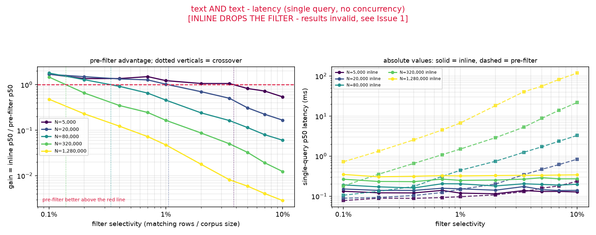

### Dimension 2: throughput under saturating load

| selectivity | N=5,000 | N=20,000 | N=80,000 | N=320,000 | N=1,280,000 |
|---|---|---|---|---|---|
| 0.100% | **1.11x** (12049 / 13387) | **1.01x** (12005 / 12153) | **1.04x** (12149 / 12688) | **1.03x** (11977 / 12380) | **0.43x** (11984 / 5117) |
| 0.200% | **1.04x** (12124 / 12644) | **1.04x** (11985 / 12498) | **1.03x** (12198 / 12582) | **1.01x** (11963 / 12094) | **0.16x** (12029 / 1920) |
| 0.400% | **1.05x** (12090 / 12678) | **1.04x** (11961 / 12422) | **1.01x** (12158 / 12229) | **0.48x** (11850 / 5674) | **0.08x** (11882 / 914) |
| 0.700% | **1.04x** (12143 / 12575) | **1.02x** (11977 / 12212) | **1.03x** (12039 / 12360) | **0.21x** (12128 / 2569) | **0.04x** (11930 / 511) |
| 1.000% | **1.03x** (12198 / 12552) | **1.01x** (12077 / 12207) | **0.86x** (12204 / 10522) | **0.14x** (11909 / 1696) | **0.03x** (11899 / 309) |
| 2.000% | **1.02x** (12202 / 12445) | **1.02x** (11990 / 12186) | **0.38x** (11983 / 4497) | **0.07x** (12086 / 812) | **0.01x** (11837 / 97) |
| 3.500% | **1.02x** (12125 / 12418) | **1.00x** (12026 / 12049) | **0.18x** (12094 / 2214) | **0.04x** (12070 / 449) | **0.00x** (11979 / 53) |
| 5.000% | **1.01x** (12006 / 12185) | **0.79x** (11948 / 9467) | **0.13x** (12027 / 1516) | **0.02x** (12121 / 268) | **0.00x** (11919 / 37) |
| 7.000% | **1.00x** (12137 / 12150) | **0.48x** (12019 / 5762) | **0.09x** (12078 / 1076) | **0.01x** (11991 / 151) | **0.00x** (11930 / 26) |
| 10.000% | **1.00x** (12110 / 12071) | **0.31x** (12115 / 3703) | **0.06x** (12049 / 746) | **0.01x** (12012 / 94) | **0.00x** (11924 / 18) |

Cells are **gain** (inline qps / pre-filter qps for latency, pre-filter qps / inline qps for throughput) with (inline / pre-filter) raw qps in brackets. Gain > 1 means pre-filtering is higher throughput.

Crossover (where pre-filtering stops winning): N=5,000 → 7.00%, N=20,000 → 3.50%, N=80,000 → 0.74%, N=320,000 → 0.20%, N=1,280,000 → n/a

Saturation, per corpus size (inline path):

| N | selectivity | main thread CPU | reader pool CPU | bound |
|---|---|---|---|---|
| 5,000 | 0.100% | 41% | 55% (cap 400%) | client-bound |
| 5,000 | 0.700% | 40% | 55% (cap 400%) | client-bound |
| 5,000 | 3.500% | 40% | 55% (cap 400%) | client-bound |
| 5,000 | 10.000% | 40% | 54% (cap 400%) | client-bound |
| 20,000 | 0.100% | 40% | 68% (cap 400%) | client-bound |
| 20,000 | 0.700% | 39% | 66% (cap 400%) | client-bound |
| 20,000 | 3.500% | 39% | 67% (cap 400%) | client-bound/reader-bound |
| 20,000 | 10.000% | 40% | 67% (cap 400%) | client-bound/reader-bound |
| 80,000 | 0.100% | 41% | 98% (cap 400%) | client-bound |
| 80,000 | 0.700% | 41% | 96% (cap 400%) | client-bound |
| 80,000 | 3.500% | 42% | 98% (cap 400%) | client-bound/reader-bound |
| 80,000 | 10.000% | 41% | 97% (cap 400%) | client-bound/reader-bound |
| 320,000 | 0.100% | 42% | 143% (cap 400%) | client-bound |
| 320,000 | 0.700% | 41% | 144% (cap 400%) | client-bound/reader-bound |
| 320,000 | 3.500% | 41% | 146% (cap 400%) | client-bound/reader-bound |
| 320,000 | 10.000% | 41% | 140% (cap 400%) | client-bound/reader-bound |
| 1,280,000 | 0.100% | 41% | 192% (cap 400%) | client-bound/reader-bound |
| 1,280,000 | 0.700% | 42% | 184% (cap 400%) | client-bound/reader-bound |
| 1,280,000 | 3.500% | 42% | 189% (cap 400%) | client-bound/reader-bound |
| 1,280,000 | 10.000% | 43% | 197% (cap 400%) | client-bound/reader-bound |

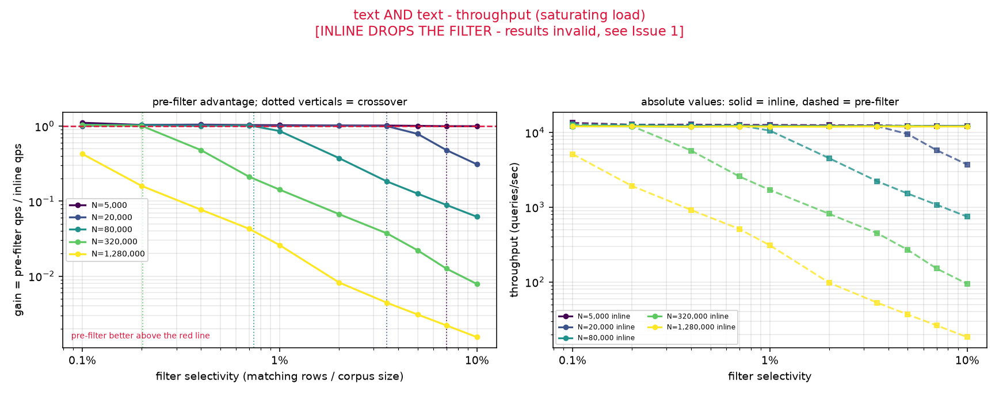

---

## Test case: num AND tag

Query template:

```
(@num:[0 {S}] @tg:{{{L}}})=>[KNN k @vec $v AS score]
```

Concrete example at N=20,000 and 1% selectivity (200 matching rows):

```
FT.SEARCH idx "(@num:[0 199] @tg:{s100})=>[KNN 10 @vec $v AS score]" PARAMS 2 v <vector> LIMIT 0 10 DIALECT 2 NOCONTENT
```

### Dimension 1: latency

| selectivity | N=5,000 | N=20,000 | N=80,000 | N=320,000 | N=1,280,000 |
|---|---|---|---|---|---|
| 0.100% | **28.45x** (2.26 / 0.08) | **63.14x** (6.28 / 0.10) | **60.52x** (8.90 / 0.15) | **30.94x** (11.52 / 0.37) | **10.00x** (15.82 / 1.58) |
| 0.200% | **21.64x** (2.07 / 0.10) | **32.08x** (3.65 / 0.11) | **19.63x** (4.22 / 0.21) | **7.83x** (6.00 / 0.77) | **2.47x** (7.28 / 2.94) |
| 0.400% | **13.84x** (1.38 / 0.10) | **14.91x** (2.11 / 0.14) | **8.52x** (3.04 / 0.36) | **2.40x** (3.43 / 1.43) | **1.04x** (5.78 / 5.57) |
| 0.700% | **9.62x** (0.99 / 0.10) | **6.93x** (1.32 / 0.19) | **3.10x** (1.79 / 0.58) | **0.79x** (1.80 / 2.27) | **0.41x** (4.49 / 10.90) |
| 1.000% | **6.07x** (0.71 / 0.12) | **4.29x** (0.97 / 0.23) | **1.37x** (1.11 / 0.81) | **0.48x** (1.46 / 3.08) | **0.20x** (3.71 / 18.23) |
| 2.000% | **2.65x** (0.39 / 0.15) | **1.62x** (0.56 / 0.34) | **0.45x** (0.65 / 1.45) | **0.22x** (1.25 / 5.72) | **0.07x** (2.74 / 38.05) |
| 3.500% | **1.97x** (0.37 / 0.19) | **0.87x** (0.55 / 0.63) | **0.22x** (0.51 / 2.34) | **0.10x** (1.02 / 10.19) | **0.03x** (2.19 / 70.60) |
| 5.000% | **1.08x** (0.25 / 0.23) | **0.45x** (0.36 / 0.80) | **0.14x** (0.44 / 3.09) | **0.06x** (0.92 / 15.23) | **0.02x** (1.69 / 101.21) |
| 7.000% | **0.77x** (0.21 / 0.28) | **0.33x** (0.34 / 1.02) | **0.10x** (0.40 / 4.09) | **0.03x** (0.78 / 24.21) | **0.01x** (1.42 / 139.59) |
| 10.000% | **0.51x** (0.18 / 0.35) | **0.21x** (0.27 / 1.30) | **0.07x** (0.35 / 5.22) | **0.02x** (0.69 / 36.37) | **0.01x** (1.03 / 188.95) |

Cells are **gain** (inline ms / pre-filter ms for latency, pre-filter qps / inline qps for throughput) with (inline / pre-filter) raw ms in brackets. Gain > 1 means pre-filtering is faster per query.

Crossover (where pre-filtering stops winning): N=5,000 → 5.41%, N=20,000 → 3.09%, N=80,000 → 1.22%, N=320,000 → 0.62%, N=1,280,000 → 0.41%


### Dimension 2: throughput under saturating load

| selectivity | N=5,000 | N=20,000 | N=80,000 | N=320,000 | N=1,280,000 |
|---|---|---|---|---|---|
| 0.100% | **7.23x** (1855 / 13401) | **18.26x** (689 / 12571) | **28.12x** (450 / 12664) | **29.42x** (382 / 11250) | **9.65x** (259 / 2503) |
| 0.200% | **6.49x** (1958 / 12709) | **10.88x** (1114 / 12117) | **13.14x** (954 / 12538) | **7.56x** (698 / 5275) | **2.23x** (573 / 1278) |
| 0.400% | **4.08x** (3073 / 12535) | **6.15x** (2030 / 12482) | **6.19x** (1902 / 11774) | **1.99x** (1335 / 2655) | **0.83x** (802 / 668) |
| 0.700% | **2.81x** (4476 / 12563) | **3.33x** (3700 / 12330) | **2.38x** (3005 / 7151) | **0.63x** (2528 / 1599) | **0.41x** (986 / 407) |
| 1.000% | **2.04x** (6166 / 12573) | **2.59x** (4745 / 12271) | **1.15x** (4320 / 4980) | **0.35x** (3370 / 1170) | **0.24x** (1155 / 276) |
| 2.000% | **1.06x** (11823 / 12528) | **1.32x** (9161 / 12099) | **0.28x** (9257 / 2613) | **0.14x** (4624 / 626) | **0.06x** (1614 / 93) |
| 3.500% | **1.03x** (12056 / 12426) | **0.62x** (11900 / 7324) | **0.13x** (11944 / 1559) | **0.06x** (5700 / 355) | **0.02x** (2148 / 51) |
| 5.000% | **1.04x** (11810 / 12324) | **0.45x** (11980 / 5411) | **0.10x** (12033 / 1185) | **0.03x** (6942 / 232) | **0.01x** (2592 / 37) |
| 7.000% | **1.02x** (11952 / 12201) | **0.35x** (11838 / 4122) | **0.08x** (11618 / 901) | **0.02x** (8173 / 143) | **0.01x** (3549 / 27) |
| 10.000% | **1.01x** (11903 / 12059) | **0.27x** (11799 / 3226) | **0.06x** (12045 / 708) | **0.01x** (10978 / 93) | **0.00x** (4714 / 20) |

Cells are **gain** (inline qps / pre-filter qps for latency, pre-filter qps / inline qps for throughput) with (inline / pre-filter) raw qps in brackets. Gain > 1 means pre-filtering is higher throughput.

Crossover (where pre-filtering stops winning): N=5,000 → n/a, N=20,000 → 2.46%, N=80,000 → 1.07%, N=320,000 → 0.56%, N=1,280,000 → 0.35%

Saturation, per corpus size (inline path):

| N | selectivity | main thread CPU | reader pool CPU | bound |
|---|---|---|---|---|
| 5,000 | 0.100% | 7% | 399% (cap 400%) | reader-bound/client-bound |
| 5,000 | 0.700% | 15% | 399% (cap 400%) | reader-bound/client-bound |
| 5,000 | 3.500% | 40% | 279% (cap 400%) | client-bound |
| 5,000 | 10.000% | 40% | 117% (cap 400%) | client-bound |
| 20,000 | 0.100% | 3% | 399% (cap 400%) | reader-bound/client-bound |
| 20,000 | 0.700% | 13% | 400% (cap 400%) | reader-bound/client-bound |
| 20,000 | 3.500% | 40% | 366% (cap 400%) | reader-bound |
| 20,000 | 10.000% | 38% | 154% (cap 400%) | client-bound/reader-bound |
| 80,000 | 0.100% | 4% | 398% (cap 400%) | reader-bound/client-bound |
| 80,000 | 0.700% | 12% | 399% (cap 400%) | reader-bound |
| 80,000 | 3.500% | 39% | 358% (cap 400%) | client-bound/reader-bound |
| 80,000 | 10.000% | 41% | 244% (cap 400%) | client-bound/reader-bound |
| 320,000 | 0.100% | 2% | 398% (cap 400%) | reader-bound |
| 320,000 | 0.700% | 10% | 399% (cap 400%) | reader-bound |
| 320,000 | 3.500% | 20% | 399% (cap 400%) | reader-bound |
| 320,000 | 10.000% | 37% | 396% (cap 400%) | reader-bound |
| 1,280,000 | 0.100% | 2% | 398% (cap 400%) | reader-bound |
| 1,280,000 | 0.700% | 4% | 399% (cap 400%) | reader-bound |
| 1,280,000 | 3.500% | 9% | 399% (cap 400%) | reader-bound |
| 1,280,000 | 10.000% | 22% | 398% (cap 400%) | reader-bound |

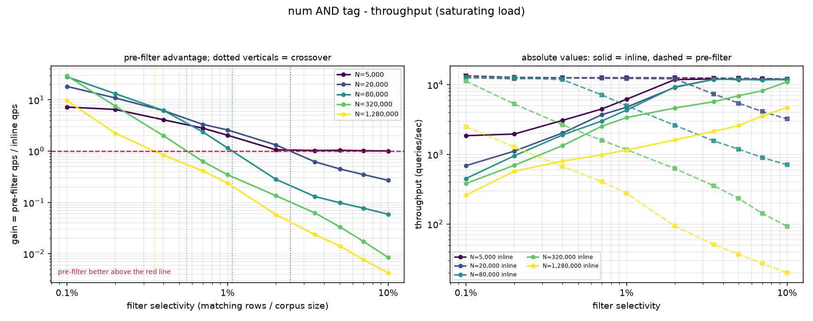

---

## Test case: num AND tag AND text

Query template:

```
(@num:[0 {S}] @tg:{{{L}}} @txt:{L})=>[KNN k @vec $v AS score]
```

Concrete example at N=20,000 and 1% selectivity (200 matching rows):

```
FT.SEARCH idx "(@num:[0 199] @tg:{s100} @txt:s100)=>[KNN 10 @vec $v AS score]" PARAMS 2 v <vector> LIMIT 0 10 DIALECT 2 NOCONTENT
```

### Dimension 1: latency

| selectivity | N=5,000 | N=20,000 | N=80,000 | N=320,000 | N=1,280,000 |
|---|---|---|---|---|---|
| 0.100% | **27.31x** (2.20 / 0.08) | **64.22x** (6.47 / 0.10) | **62.23x** (9.50 / 0.15) | **29.87x** (11.66 / 0.39) | **9.51x** (15.83 / 1.66) |
| 0.200% | **22.09x** (2.06 / 0.09) | **29.89x** (3.56 / 0.12) | **19.53x** (4.43 / 0.23) | **8.01x** (6.34 / 0.79) | **2.39x** (7.38 / 3.08) |
| 0.400% | **12.97x** (1.31 / 0.10) | **14.00x** (2.13 / 0.15) | **7.14x** (2.66 / 0.37) | **2.40x** (3.58 / 1.49) | **0.85x** (5.53 / 6.50) |
| 0.700% | **9.58x** (1.04 / 0.11) | **6.32x** (1.26 / 0.20) | **2.96x** (1.89 / 0.64) | **0.81x** (1.90 / 2.34) | **0.41x** (4.60 / 11.35) |
| 1.000% | **6.19x** (0.74 / 0.12) | **4.08x** (0.92 / 0.23) | **1.81x** (1.56 / 0.86) | **0.48x** (1.53 / 3.21) | **0.22x** (3.77 / 16.87) |
| 2.000% | **2.50x** (0.38 / 0.15) | **1.53x** (0.55 / 0.36) | **0.54x** (0.80 / 1.50) | **0.21x** (1.25 / 5.91) | **0.07x** (2.74 / 39.90) |
| 3.500% | **1.77x** (0.33 / 0.18) | **0.81x** (0.53 / 0.65) | **0.21x** (0.52 / 2.42) | **0.09x** (1.03 / 11.06) | **0.03x** (2.09 / 70.47) |
| 5.000% | **0.99x** (0.22 / 0.22) | **0.43x** (0.36 / 0.82) | **0.13x** (0.43 / 3.29) | **0.06x** (0.93 / 15.47) | **0.02x** (1.72 / 100.06) |
| 7.000% | **0.75x** (0.20 / 0.27) | **0.27x** (0.28 / 1.06) | **0.09x** (0.40 / 4.25) | **0.03x** (0.79 / 26.65) | **0.01x** (1.39 / 139.33) |
| 10.000% | **0.49x** (0.18 / 0.36) | **0.17x** (0.22 / 1.34) | **0.06x** (0.36 / 5.60) | **0.02x** (0.68 / 37.14) | **0.01x** (1.00 / 193.36) |

Cells are **gain** (inline ms / pre-filter ms for latency, pre-filter qps / inline qps for throughput) with (inline / pre-filter) raw ms in brackets. Gain > 1 means pre-filtering is faster per query.

Crossover (where pre-filtering stops winning): N=5,000 → 4.98%, N=20,000 → 2.91%, N=80,000 → 1.40%, N=320,000 → 0.63%, N=1,280,000 → 0.36%

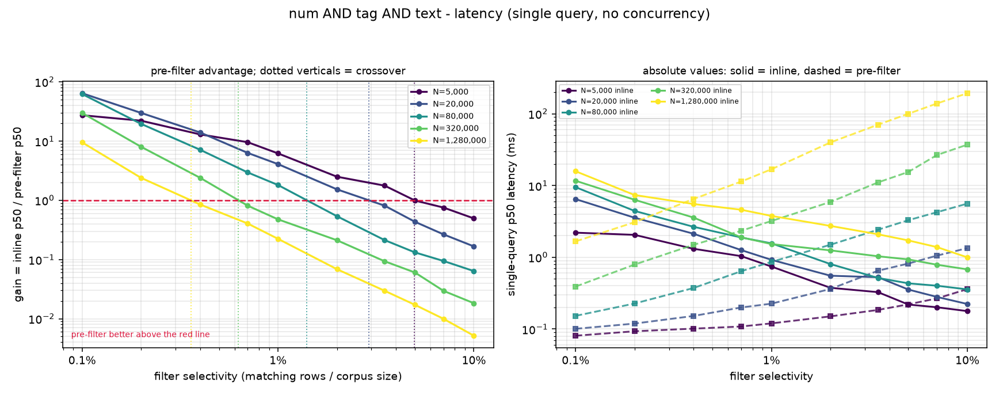

### Dimension 2: throughput under saturating load

| selectivity | N=5,000 | N=20,000 | N=80,000 | N=320,000 | N=1,280,000 |
|---|---|---|---|---|---|
| 0.100% | **7.23x** (1856 / 13415) | **18.27x** (685 / 12519) | **27.63x** (457 / 12615) | **29.06x** (381 / 11084) | **9.04x** (259 / 2344) |
| 0.200% | **6.43x** (1966 / 12634) | **11.25x** (1112 / 12520) | **13.48x** (934 / 12591) | **7.28x** (697 / 5073) | **2.03x** (566 / 1150) |
| 0.400% | **4.06x** (3111 / 12625) | **6.18x** (2005 / 12386) | **6.08x** (1894 / 11514) | **1.87x** (1343 / 2508) | **0.73x** (798 / 581) |
| 0.700% | **2.79x** (4488 / 12498) | **3.27x** (3755 / 12267) | **2.19x** (2976 / 6521) | **0.58x** (2563 / 1479) | **0.36x** (975 / 347) |
| 1.000% | **2.00x** (6243 / 12501) | **2.52x** (4848 / 12199) | **1.04x** (4390 / 4558) | **0.31x** (3394 / 1064) | **0.20x** (1144 / 226) |
| 2.000% | **1.07x** (11579 / 12351) | **1.32x** (9196 / 12095) | **0.25x** (9072 / 2310) | **0.12x** (4539 / 547) | **0.05x** (1594 / 79) |
| 3.500% | **1.02x** (12113 / 12378) | **0.57x** (11872 / 6711) | **0.12x** (11874 / 1386) | **0.05x** (6081 / 316) | **0.02x** (2125 / 42) |
| 5.000% | **1.04x** (11868 / 12298) | **0.41x** (11997 / 4889) | **0.09x** (11878 / 1014) | **0.03x** (7417 / 191) | **0.01x** (2657 / 30) |
| 7.000% | **0.99x** (12160 / 12097) | **0.30x** (11926 / 3610) | **0.06x** (11961 / 748) | **0.01x** (8960 / 115) | **0.01x** (3557 / 21) |
| 10.000% | **1.02x** (11955 / 12135) | **0.23x** (11728 / 2695) | **0.05x** (12062 / 578) | **0.01x** (10814 / 77) | **0.00x** (5184 / 15) |

Cells are **gain** (inline qps / pre-filter qps for latency, pre-filter qps / inline qps for throughput) with (inline / pre-filter) raw qps in brackets. Gain > 1 means pre-filtering is higher throughput.

Crossover (where pre-filtering stops winning): N=5,000 → n/a, N=20,000 → 2.41%, N=80,000 → 1.02%, N=320,000 → 0.54%, N=1,280,000 → 0.32%

Saturation, per corpus size (inline path):

| N | selectivity | main thread CPU | reader pool CPU | bound |
|---|---|---|---|---|
| 5,000 | 0.100% | 7% | 400% (cap 400%) | reader-bound/client-bound |
| 5,000 | 0.700% | 16% | 400% (cap 400%) | reader-bound/client-bound |
| 5,000 | 3.500% | 45% | 279% (cap 400%) | client-bound |
| 5,000 | 10.000% | 40% | 119% (cap 400%) | client-bound/reader-bound |
| 20,000 | 0.100% | 3% | 400% (cap 400%) | reader-bound/client-bound |
| 20,000 | 0.700% | 14% | 399% (cap 400%) | reader-bound/client-bound |
| 20,000 | 3.500% | 44% | 373% (cap 400%) | reader-bound |
| 20,000 | 10.000% | 40% | 155% (cap 400%) | client-bound/reader-bound |
| 80,000 | 0.100% | 3% | 400% (cap 400%) | reader-bound/client-bound |
| 80,000 | 0.700% | 12% | 399% (cap 400%) | reader-bound |
| 80,000 | 3.500% | 42% | 355% (cap 400%) | client-bound/reader-bound |
| 80,000 | 10.000% | 42% | 247% (cap 400%) | client-bound/reader-bound |
| 320,000 | 0.100% | 2% | 399% (cap 400%) | reader-bound |
| 320,000 | 0.700% | 10% | 399% (cap 400%) | reader-bound |
| 320,000 | 3.500% | 22% | 399% (cap 400%) | reader-bound |
| 320,000 | 10.000% | 37% | 398% (cap 400%) | reader-bound |
| 1,280,000 | 0.100% | 2% | 399% (cap 400%) | reader-bound |
| 1,280,000 | 0.700% | 4% | 399% (cap 400%) | reader-bound |
| 1,280,000 | 3.500% | 9% | 399% (cap 400%) | reader-bound |
| 1,280,000 | 10.000% | 18% | 399% (cap 400%) | reader-bound |


---

## Test case: num AND NOT tag

Query template:

```
(@num:[0 {S}] -@tg:{{none}})=>[KNN k @vec $v AS score]
```

Concrete example at N=20,000 and 1% selectivity (200 matching rows):

```
FT.SEARCH idx "(@num:[0 199] -@tg:{none})=>[KNN 10 @vec $v AS score]" PARAMS 2 v <vector> LIMIT 0 10 DIALECT 2 NOCONTENT
```

### Dimension 1: latency

| selectivity | N=5,000 | N=20,000 | N=80,000 | N=320,000 | N=1,280,000 |
|---|---|---|---|---|---|
| 0.100% | **28.25x** (2.23 / 0.08) | **66.05x** (6.67 / 0.10) | **56.36x** (8.70 / 0.15) | **27.14x** (11.28 / 0.42) | **9.70x** (15.75 / 1.62) |
| 0.200% | **22.89x** (2.08 / 0.09) | **29.49x** (3.58 / 0.12) | **20.29x** (4.36 / 0.21) | **7.56x** (6.35 / 0.84) | **2.37x** (7.29 / 3.07) |
| 0.400% | **13.97x** (1.35 / 0.10) | **14.55x** (2.20 / 0.15) | **8.04x** (2.81 / 0.35) | **2.24x** (3.56 / 1.59) | **0.94x** (5.45 / 5.78) |
| 0.700% | **9.11x** (0.99 / 0.11) | **7.14x** (1.30 / 0.18) | **2.98x** (1.80 / 0.60) | **0.85x** (1.98 / 2.33) | **0.41x** (4.45 / 10.98) |
| 1.000% | **6.13x** (0.74 / 0.12) | **4.48x** (0.98 / 0.22) | **1.45x** (1.22 / 0.84) | **0.48x** (1.51 / 3.15) | **0.25x** (3.71 / 14.74) |
| 2.000% | **2.63x** (0.40 / 0.15) | **1.54x** (0.57 / 0.37) | **0.49x** (0.70 / 1.44) | **0.21x** (1.21 / 5.88) | **0.07x** (2.82 / 37.68) |
| 3.500% | **1.86x** (0.35 / 0.19) | **0.88x** (0.53 / 0.61) | **0.22x** (0.52 / 2.37) | **0.09x** (1.02 / 11.07) | **0.03x** (2.10 / 70.98) |
| 5.000% | **1.13x** (0.24 / 0.21) | **0.44x** (0.34 / 0.77) | **0.14x** (0.42 / 3.10) | **0.06x** (0.92 / 15.67) | **0.02x** (1.71 / 103.42) |
| 7.000% | **0.75x** (0.19 / 0.25) | **0.27x** (0.27 / 1.00) | **0.09x** (0.38 / 4.11) | **0.03x** (0.79 / 23.25) | **0.01x** (1.41 / 142.80) |
| 10.000% | **0.48x** (0.15 / 0.32) | **0.16x** (0.20 / 1.26) | **0.07x** (0.35 / 5.41) | **0.02x** (0.67 / 36.08) | **0.01x** (1.08 / 191.35) |

Cells are **gain** (inline ms / pre-filter ms for latency, pre-filter qps / inline qps for throughput) with (inline / pre-filter) raw ms in brackets. Gain > 1 means pre-filtering is faster per query.

Crossover (where pre-filtering stops winning): N=5,000 → 5.55%, N=20,000 → 3.07%, N=80,000 → 1.27%, N=320,000 → 0.64%, N=1,280,000 → 0.38%

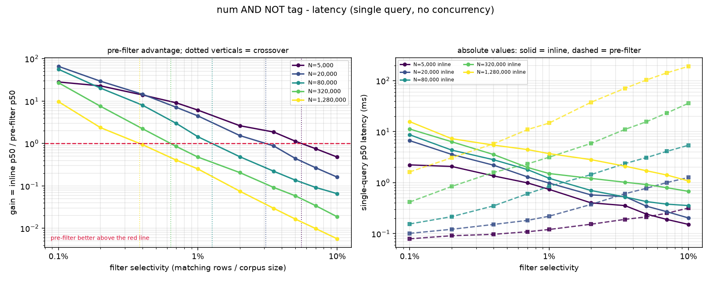

### Dimension 2: throughput under saturating load

| selectivity | N=5,000 | N=20,000 | N=80,000 | N=320,000 | N=1,280,000 |
|---|---|---|---|---|---|
| 0.100% | **7.20x** (1839 / 13242) | **18.50x** (682 / 12619) | **27.91x** (451 / 12579) | **27.90x** (385 / 10730) | **9.49x** (263 / 2494) |
| 0.200% | **6.55x** (1946 / 12740) | **11.25x** (1101 / 12392) | **13.28x** (941 / 12492) | **7.24x** (700 / 5067) | **2.20x** (578 / 1272) |
| 0.400% | **3.98x** (3137 / 12498) | **6.28x** (1990 / 12485) | **6.11x** (1891 / 11564) | **1.97x** (1328 / 2616) | **0.82x** (795 / 649) |
| 0.700% | **2.90x** (4331 / 12571) | **3.33x** (3744 / 12453) | **2.21x** (3035 / 6698) | **0.62x** (2566 / 1589) | **0.40x** (974 / 394) |
| 1.000% | **2.04x** (6117 / 12498) | **2.61x** (4713 / 12292) | **1.11x** (4325 / 4779) | **0.34x** (3354 / 1154) | **0.23x** (1152 / 266) |
| 2.000% | **1.07x** (11684 / 12474) | **1.32x** (9217 / 12157) | **0.28x** (9157 / 2587) | **0.13x** (4720 / 613) | **0.06x** (1604 / 92) |
| 3.500% | **1.04x** (11973 / 12426) | **0.60x** (11989 / 7243) | **0.13x** (11942 / 1543) | **0.06x** (6217 / 362) | **0.02x** (2144 / 51) |
| 5.000% | **1.04x** (11798 / 12268) | **0.45x** (11978 / 5347) | **0.10x** (12004 / 1162) | **0.03x** (7729 / 227) | **0.01x** (2725 / 37) |
| 7.000% | **1.02x** (11921 / 12168) | **0.33x** (12125 / 3989) | **0.07x** (12281 / 894) | **0.02x** (8523 / 142) | **0.01x** (3669 / 27) |
| 10.000% | **1.03x** (11828 / 12186) | **0.27x** (11844 / 3219) | **0.06x** (12042 / 720) | **0.01x** (11240 / 93) | **0.00x** (5176 / 20) |

Cells are **gain** (inline qps / pre-filter qps for latency, pre-filter qps / inline qps for throughput) with (inline / pre-filter) raw qps in brackets. Gain > 1 means pre-filtering is higher throughput.

Crossover (where pre-filtering stops winning): N=5,000 → n/a, N=20,000 → 2.44%, N=80,000 → 1.05%, N=320,000 → 0.56%, N=1,280,000 → 0.35%

Saturation, per corpus size (inline path):

| N | selectivity | main thread CPU | reader pool CPU | bound |
|---|---|---|---|---|
| 5,000 | 0.100% | 7% | 400% (cap 400%) | reader-bound/client-bound |
| 5,000 | 0.700% | 14% | 398% (cap 400%) | reader-bound/client-bound |
| 5,000 | 3.500% | 41% | 276% (cap 400%) | client-bound |
| 5,000 | 10.000% | 38% | 117% (cap 400%) | client-bound |
| 20,000 | 0.100% | 3% | 400% (cap 400%) | reader-bound/client-bound |
| 20,000 | 0.700% | 16% | 399% (cap 400%) | reader-bound/client-bound |
| 20,000 | 3.500% | 41% | 366% (cap 400%) | reader-bound |
| 20,000 | 10.000% | 39% | 156% (cap 400%) | client-bound/reader-bound |
| 80,000 | 0.100% | 2% | 399% (cap 400%) | reader-bound/client-bound |
| 80,000 | 0.700% | 12% | 400% (cap 400%) | reader-bound |
| 80,000 | 3.500% | 40% | 356% (cap 400%) | client-bound/reader-bound |
| 80,000 | 10.000% | 40% | 241% (cap 400%) | client-bound/reader-bound |
| 320,000 | 0.100% | 3% | 398% (cap 400%) | reader-bound |
| 320,000 | 0.700% | 11% | 399% (cap 400%) | reader-bound |
| 320,000 | 3.500% | 22% | 399% (cap 400%) | reader-bound |
| 320,000 | 10.000% | 39% | 398% (cap 400%) | reader-bound |
| 1,280,000 | 0.100% | 3% | 398% (cap 400%) | reader-bound |
| 1,280,000 | 0.700% | 5% | 399% (cap 400%) | reader-bound |
| 1,280,000 | 3.500% | 9% | 400% (cap 400%) | reader-bound |
| 1,280,000 | 10.000% | 18% | 398% (cap 400%) | reader-bound |

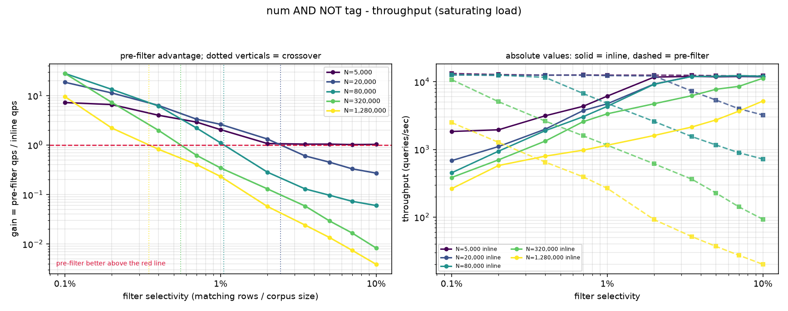

---

